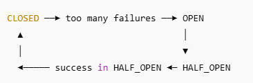

## Trying Reslience4j Reactive

### 1. CLOSED State
1. Everything looks fine. Let requests flow.
2. All calls are allowed through.
3. Failures are recorded.
4. If failure rate exceeds a threshold (e.g., 50%) over a sliding window, the circuit transitions to OPEN.

### 2. OPEN State
1. Too many failures. Stop! Don’t call the service.
2. No calls are allowed through — they fail fast with a CallNotPermittedException.
3. After a configurable waitDurationInOpenState, the breaker transitions to HALF_OPEN to test recovery.

### HALF_OPEN State 
1. Let me test a few requests. Maybe the service is back? 
2. Allows only a limited number of trial calls. 
3. If a certain number of successes occur → transitions back to CLOSED. 
4. If any trial call fails → goes back to OPEN.

**Visual Representation of Circuit Breaker States:**



**These are special, usually manual states:**
1. DISABLED: No protection, breaker does nothing.
2. FORCED_OPEN: Always blocks calls, like OPEN but never transitions.
3. FORCED_CLOSED: Always allows calls, like CLOSED but never transitions.

### Engineering Dilemma: Where to circuit break?
Do you circuit break in the controller or the service layer?
The answer to this question depends on what you are circuit breaking. 

**Typically, Your Service Layer - When You Have Downstream unstable API integration**
- Also, your controller should only worry about HTTP request/response mapping.
- Shouldn't be aware of your service layer or downstream orchestration.
- Circuit breaking is a business resilience concern to protect your service from downstream failures.
- Your service layer has access to the context: which downstreams, retries, fallbacks, metrics, etc.

**What Are You Circuit Breaking?**
- Let’s say your service integrates with a downstream API (like payment gateway, identity provider, external CRM).
- You're circuit breaking that downstream call.
- Not your own API per se, but the outgoing call from your service to the external system.

**Think of it like:**
- ❌ "This payment API keeps failing, let’s stop calling it for 60 seconds."
- ✅ _**NOT: "Let’s reject calls to our endpoint."**_

But… it does affect your API users.
Because when the breaker is open:

You might respond with fallback data.

Or HTTP 503 / 429.

Or redirect traffic (in case of HA setups).

Or just fail fast instead of hanging on retries.


### Test the Circuit Breaker
1. Start the application.
```bash
mvn clean install

mvn spring-boot:run 2>&1 | tee logs/app.log

./demo.sh > logs/demo.log

```
***Demo Output***
```log
Starting Resilience4j simulation with longer OPEN state and 40% failure rate...
[1] ✅ Simulating SUCCESS: orderId=1, productId=1
{"orderId":1,"status":"PLACED"}
Status: 200

---
📡 Circuit Breaker State:
{"circuitBreakers":{"orderVendorAPICB":{"failureRate":"-1.0%","slowCallRate":"-1.0%","failureRateThreshold":"30.0%","slowCallRateThreshold":"100.0%","bufferedCalls":8,"failedCalls":0,"slowCalls":0,"slowFailedCalls":0,"notPermittedCalls":0,"state":"CLOSED"}}}
========== SLEEPING (2 s) ==========

[2] ✅ Simulating SUCCESS: orderId=2, productId=2
{"orderId":2,"status":"PLACED"}
Status: 200

---
📡 Circuit Breaker State:
{"circuitBreakers":{"orderVendorAPICB":{"failureRate":"-1.0%","slowCallRate":"-1.0%","failureRateThreshold":"30.0%","slowCallRateThreshold":"100.0%","bufferedCalls":9,"failedCalls":0,"slowCalls":0,"slowFailedCalls":0,"notPermittedCalls":0,"state":"CLOSED"}}}
========== SLEEPING (2 s) ==========

[3] ✅ Simulating SUCCESS: orderId=3, productId=3
{"orderId":3,"status":"PLACED"}
Status: 200

---
📡 Circuit Breaker State:
{"circuitBreakers":{"orderVendorAPICB":{"failureRate":"0.0%","slowCallRate":"0.0%","failureRateThreshold":"30.0%","slowCallRateThreshold":"100.0%","bufferedCalls":10,"failedCalls":0,"slowCalls":0,"slowFailedCalls":0,"notPermittedCalls":0,"state":"CLOSED"}}}
========== SLEEPING (2 s) ==========

[4] ✅ Simulating SUCCESS: orderId=4, productId=4
{"orderId":4,"status":"PLACED"}
Status: 200

---
📡 Circuit Breaker State:
{"circuitBreakers":{"orderVendorAPICB":{"failureRate":"0.0%","slowCallRate":"0.0%","failureRateThreshold":"30.0%","slowCallRateThreshold":"100.0%","bufferedCalls":10,"failedCalls":0,"slowCalls":0,"slowFailedCalls":0,"notPermittedCalls":0,"state":"CLOSED"}}}
========== SLEEPING (2 s) ==========

[5] ✅ Simulating SUCCESS: orderId=5, productId=5
{"orderId":5,"status":"PLACED"}
Status: 200

---
📡 Circuit Breaker State:
{"circuitBreakers":{"orderVendorAPICB":{"failureRate":"0.0%","slowCallRate":"0.0%","failureRateThreshold":"30.0%","slowCallRateThreshold":"100.0%","bufferedCalls":10,"failedCalls":0,"slowCalls":0,"slowFailedCalls":0,"notPermittedCalls":0,"state":"CLOSED"}}}
========== SLEEPING (2 s) ==========

[6] ✅ Simulating SUCCESS: orderId=6, productId=6
{"orderId":6,"status":"PLACED"}
Status: 200

---
📡 Circuit Breaker State:
{"circuitBreakers":{"orderVendorAPICB":{"failureRate":"0.0%","slowCallRate":"0.0%","failureRateThreshold":"30.0%","slowCallRateThreshold":"100.0%","bufferedCalls":10,"failedCalls":0,"slowCalls":0,"slowFailedCalls":0,"notPermittedCalls":0,"state":"CLOSED"}}}
========== SLEEPING (2 s) ==========

[7] ✅ Simulating SUCCESS: orderId=7, productId=7
{"orderId":7,"status":"PLACED"}
Status: 200

---
📡 Circuit Breaker State:
{"circuitBreakers":{"orderVendorAPICB":{"failureRate":"0.0%","slowCallRate":"0.0%","failureRateThreshold":"30.0%","slowCallRateThreshold":"100.0%","bufferedCalls":10,"failedCalls":0,"slowCalls":0,"slowFailedCalls":0,"notPermittedCalls":0,"state":"CLOSED"}}}
========== SLEEPING (2 s) ==========

[8] ✅ Simulating SUCCESS: orderId=8, productId=8
{"orderId":8,"status":"PLACED"}
Status: 200

---
📡 Circuit Breaker State:
{"circuitBreakers":{"orderVendorAPICB":{"failureRate":"0.0%","slowCallRate":"0.0%","failureRateThreshold":"30.0%","slowCallRateThreshold":"100.0%","bufferedCalls":10,"failedCalls":0,"slowCalls":0,"slowFailedCalls":0,"notPermittedCalls":0,"state":"CLOSED"}}}
========== SLEEPING (2 s) ==========

[9] ✅ Simulating SUCCESS: orderId=9, productId=9
{"orderId":9,"status":"PLACED"}
Status: 200

---
📡 Circuit Breaker State:
{"circuitBreakers":{"orderVendorAPICB":{"failureRate":"0.0%","slowCallRate":"0.0%","failureRateThreshold":"30.0%","slowCallRateThreshold":"100.0%","bufferedCalls":10,"failedCalls":0,"slowCalls":0,"slowFailedCalls":0,"notPermittedCalls":0,"state":"CLOSED"}}}
========== SLEEPING (2 s) ==========

[10] ✅ Simulating SUCCESS: orderId=10, productId=10
{"orderId":10,"status":"PLACED"}
Status: 200

---
📡 Circuit Breaker State:
{"circuitBreakers":{"orderVendorAPICB":{"failureRate":"0.0%","slowCallRate":"0.0%","failureRateThreshold":"30.0%","slowCallRateThreshold":"100.0%","bufferedCalls":10,"failedCalls":0,"slowCalls":0,"slowFailedCalls":0,"notPermittedCalls":0,"state":"CLOSED"}}}
========== SLEEPING (2 s) ==========

[11] ✅ Simulating SUCCESS: orderId=11, productId=11
{"orderId":11,"status":"PLACED"}
Status: 200

---
📡 Circuit Breaker State:
{"circuitBreakers":{"orderVendorAPICB":{"failureRate":"0.0%","slowCallRate":"0.0%","failureRateThreshold":"30.0%","slowCallRateThreshold":"100.0%","bufferedCalls":10,"failedCalls":0,"slowCalls":0,"slowFailedCalls":0,"notPermittedCalls":0,"state":"CLOSED"}}}
========== SLEEPING (2 s) ==========

[12] ✅ Simulating SUCCESS: orderId=12, productId=12
{"orderId":12,"status":"PLACED"}
Status: 200

---
📡 Circuit Breaker State:
{"circuitBreakers":{"orderVendorAPICB":{"failureRate":"0.0%","slowCallRate":"0.0%","failureRateThreshold":"30.0%","slowCallRateThreshold":"100.0%","bufferedCalls":10,"failedCalls":0,"slowCalls":0,"slowFailedCalls":0,"notPermittedCalls":0,"state":"CLOSED"}}}
========== SLEEPING (2 s) ==========

[13] ✅ Simulating SUCCESS: orderId=13, productId=13
{"orderId":13,"status":"PLACED"}
Status: 200

---
📡 Circuit Breaker State:
{"circuitBreakers":{"orderVendorAPICB":{"failureRate":"0.0%","slowCallRate":"0.0%","failureRateThreshold":"30.0%","slowCallRateThreshold":"100.0%","bufferedCalls":10,"failedCalls":0,"slowCalls":0,"slowFailedCalls":0,"notPermittedCalls":0,"state":"CLOSED"}}}
========== SLEEPING (2 s) ==========

[14] ✅ Simulating SUCCESS: orderId=14, productId=14
{"orderId":14,"status":"PLACED"}
Status: 200

---
📡 Circuit Breaker State:
{"circuitBreakers":{"orderVendorAPICB":{"failureRate":"0.0%","slowCallRate":"0.0%","failureRateThreshold":"30.0%","slowCallRateThreshold":"100.0%","bufferedCalls":10,"failedCalls":0,"slowCalls":0,"slowFailedCalls":0,"notPermittedCalls":0,"state":"CLOSED"}}}
========== SLEEPING (2 s) ==========

[15] ❌ Simulating FAILURE: orderId=15, productId=15
{"orderId":15,"status":"PENDING"}
Status: 200

---
📡 Circuit Breaker State:
{"circuitBreakers":{"orderVendorAPICB":{"failureRate":"10.0%","slowCallRate":"0.0%","failureRateThreshold":"30.0%","slowCallRateThreshold":"100.0%","bufferedCalls":10,"failedCalls":1,"slowCalls":0,"slowFailedCalls":0,"notPermittedCalls":0,"state":"CLOSED"}}}
========== SLEEPING (2 s) ==========

[16] ❌ Simulating FAILURE: orderId=16, productId=16
{"orderId":16,"status":"PENDING"}
Status: 200

---
📡 Circuit Breaker State:
{"circuitBreakers":{"orderVendorAPICB":{"failureRate":"20.0%","slowCallRate":"0.0%","failureRateThreshold":"30.0%","slowCallRateThreshold":"100.0%","bufferedCalls":10,"failedCalls":2,"slowCalls":0,"slowFailedCalls":0,"notPermittedCalls":0,"state":"CLOSED"}}}
========== SLEEPING (2 s) ==========

[17] ❌ Simulating FAILURE: orderId=17, productId=17
{"orderId":17,"status":"PENDING"}
Status: 200

---
📡 Circuit Breaker State:
{"circuitBreakers":{"orderVendorAPICB":{"failureRate":"30.0%","slowCallRate":"0.0%","failureRateThreshold":"30.0%","slowCallRateThreshold":"100.0%","bufferedCalls":10,"failedCalls":3,"slowCalls":0,"slowFailedCalls":0,"notPermittedCalls":0,"state":"OPEN"}}}
========== SLEEPING (2 s) ==========

[18] ❌ Simulating FAILURE: orderId=18, productId=18
{"orderId":18,"status":"PENDING"}
Status: 200

---
📡 Circuit Breaker State:
{"circuitBreakers":{"orderVendorAPICB":{"failureRate":"-1.0%","slowCallRate":"-1.0%","failureRateThreshold":"30.0%","slowCallRateThreshold":"100.0%","bufferedCalls":1,"failedCalls":1,"slowCalls":0,"slowFailedCalls":0,"notPermittedCalls":0,"state":"HALF_OPEN"}}}
========== SLEEPING (2 s) ==========

[19] ❌ Simulating FAILURE: orderId=19, productId=19
{"orderId":19,"status":"PENDING"}
Status: 200

---
📡 Circuit Breaker State:
{"circuitBreakers":{"orderVendorAPICB":{"failureRate":"100.0%","slowCallRate":"0.0%","failureRateThreshold":"30.0%","slowCallRateThreshold":"100.0%","bufferedCalls":2,"failedCalls":2,"slowCalls":0,"slowFailedCalls":0,"notPermittedCalls":0,"state":"OPEN"}}}
========== SLEEPING (2 s) ==========

[20] ❌ Simulating FAILURE: orderId=20, productId=20
{"orderId":20,"status":"PENDING"}
Status: 200

---
📡 Circuit Breaker State:
{"circuitBreakers":{"orderVendorAPICB":{"failureRate":"-1.0%","slowCallRate":"-1.0%","failureRateThreshold":"30.0%","slowCallRateThreshold":"100.0%","bufferedCalls":1,"failedCalls":1,"slowCalls":0,"slowFailedCalls":0,"notPermittedCalls":0,"state":"HALF_OPEN"}}}
========== SLEEPING (2 s) ==========

[21] ✅ Simulating SUCCESS: orderId=21, productId=21
{"orderId":21,"status":"PLACED"}
Status: 200

---
📡 Circuit Breaker State:
{"circuitBreakers":{"orderVendorAPICB":{"failureRate":"50.0%","slowCallRate":"0.0%","failureRateThreshold":"30.0%","slowCallRateThreshold":"100.0%","bufferedCalls":2,"failedCalls":1,"slowCalls":0,"slowFailedCalls":0,"notPermittedCalls":0,"state":"OPEN"}}}
========== SLEEPING (2 s) ==========

[22] ✅ Simulating SUCCESS: orderId=22, productId=22
{"orderId":22,"status":"PLACED"}
Status: 200

---
📡 Circuit Breaker State:
{"circuitBreakers":{"orderVendorAPICB":{"failureRate":"-1.0%","slowCallRate":"-1.0%","failureRateThreshold":"30.0%","slowCallRateThreshold":"100.0%","bufferedCalls":1,"failedCalls":0,"slowCalls":0,"slowFailedCalls":0,"notPermittedCalls":0,"state":"HALF_OPEN"}}}
========== SLEEPING (2 s) ==========

[23] ✅ Simulating SUCCESS: orderId=23, productId=23
{"orderId":23,"status":"PLACED"}
Status: 200

---
📡 Circuit Breaker State:
{"circuitBreakers":{"orderVendorAPICB":{"failureRate":"-1.0%","slowCallRate":"-1.0%","failureRateThreshold":"30.0%","slowCallRateThreshold":"100.0%","bufferedCalls":0,"failedCalls":0,"slowCalls":0,"slowFailedCalls":0,"notPermittedCalls":0,"state":"CLOSED"}}}
========== SLEEPING (2 s) ==========

[24] ✅ Simulating SUCCESS: orderId=24, productId=24
{"orderId":24,"status":"PLACED"}
Status: 200

---
📡 Circuit Breaker State:
{"circuitBreakers":{"orderVendorAPICB":{"failureRate":"-1.0%","slowCallRate":"-1.0%","failureRateThreshold":"30.0%","slowCallRateThreshold":"100.0%","bufferedCalls":1,"failedCalls":0,"slowCalls":0,"slowFailedCalls":0,"notPermittedCalls":0,"state":"CLOSED"}}}
========== SLEEPING (2 s) ==========

[25] ✅ Simulating SUCCESS: orderId=25, productId=25
{"orderId":25,"status":"PLACED"}
Status: 200

---
📡 Circuit Breaker State:
{"circuitBreakers":{"orderVendorAPICB":{"failureRate":"-1.0%","slowCallRate":"-1.0%","failureRateThreshold":"30.0%","slowCallRateThreshold":"100.0%","bufferedCalls":2,"failedCalls":0,"slowCalls":0,"slowFailedCalls":0,"notPermittedCalls":0,"state":"CLOSED"}}}
========== SLEEPING (2 s) ==========

[26] ✅ Simulating SUCCESS: orderId=26, productId=26
{"orderId":26,"status":"PLACED"}
Status: 200

---
📡 Circuit Breaker State:
{"circuitBreakers":{"orderVendorAPICB":{"failureRate":"-1.0%","slowCallRate":"-1.0%","failureRateThreshold":"30.0%","slowCallRateThreshold":"100.0%","bufferedCalls":3,"failedCalls":0,"slowCalls":0,"slowFailedCalls":0,"notPermittedCalls":0,"state":"CLOSED"}}}
========== SLEEPING (2 s) ==========

[27] ✅ Simulating SUCCESS: orderId=27, productId=27
{"orderId":27,"status":"PLACED"}
Status: 200

---
📡 Circuit Breaker State:
{"circuitBreakers":{"orderVendorAPICB":{"failureRate":"-1.0%","slowCallRate":"-1.0%","failureRateThreshold":"30.0%","slowCallRateThreshold":"100.0%","bufferedCalls":4,"failedCalls":0,"slowCalls":0,"slowFailedCalls":0,"notPermittedCalls":0,"state":"CLOSED"}}}
========== SLEEPING (2 s) ==========

[28] ✅ Simulating SUCCESS: orderId=28, productId=28
{"orderId":28,"status":"PLACED"}
Status: 200

---
📡 Circuit Breaker State:
{"circuitBreakers":{"orderVendorAPICB":{"failureRate":"-1.0%","slowCallRate":"-1.0%","failureRateThreshold":"30.0%","slowCallRateThreshold":"100.0%","bufferedCalls":5,"failedCalls":0,"slowCalls":0,"slowFailedCalls":0,"notPermittedCalls":0,"state":"CLOSED"}}}
========== SLEEPING (2 s) ==========

[29] ✅ Simulating SUCCESS: orderId=29, productId=29
{"orderId":29,"status":"PLACED"}
Status: 200

---
📡 Circuit Breaker State:
{"circuitBreakers":{"orderVendorAPICB":{"failureRate":"-1.0%","slowCallRate":"-1.0%","failureRateThreshold":"30.0%","slowCallRateThreshold":"100.0%","bufferedCalls":6,"failedCalls":0,"slowCalls":0,"slowFailedCalls":0,"notPermittedCalls":0,"state":"CLOSED"}}}
========== SLEEPING (2 s) ==========

[30] ✅ Simulating SUCCESS: orderId=30, productId=30
{"orderId":30,"status":"PLACED"}
Status: 200

---
📡 Circuit Breaker State:
{"circuitBreakers":{"orderVendorAPICB":{"failureRate":"-1.0%","slowCallRate":"-1.0%","failureRateThreshold":"30.0%","slowCallRateThreshold":"100.0%","bufferedCalls":7,"failedCalls":0,"slowCalls":0,"slowFailedCalls":0,"notPermittedCalls":0,"state":"CLOSED"}}}
========== SLEEPING (2 s) ==========

Simulation complete.
```

**NEXT Steps:**
🔍 Test Cases

📊 Exposing Resilience4j metrics via Actuator

📈 Explore more configuration options 

🧪 Add another API with different circuit breaker settings

💣 API curl on loop and watch the circuit breaker state through health API

Thank you!!